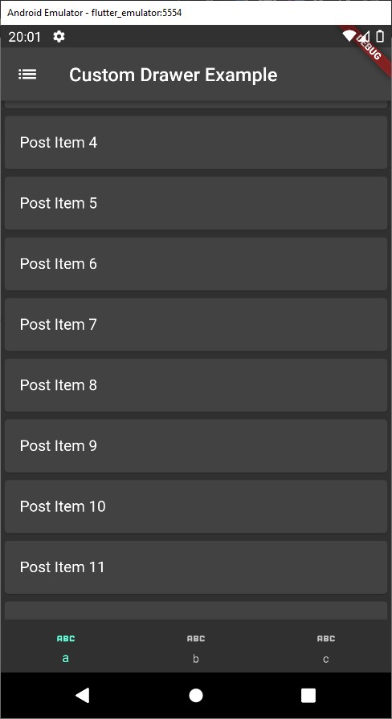
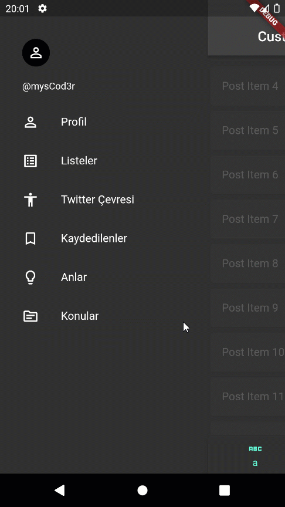
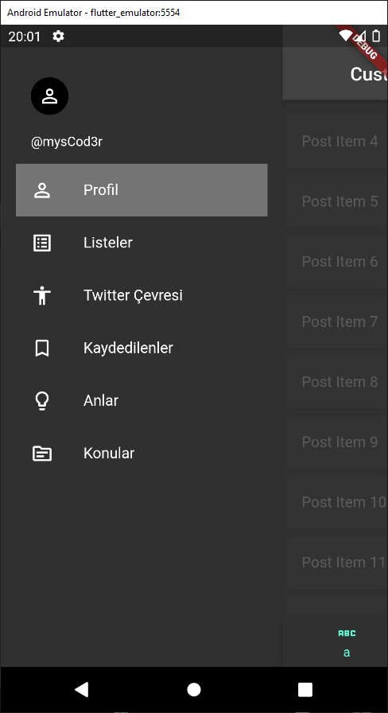

# flutter_specific_drawer

## Twitter IOS Drawer 

Drawer açılırken:
- app barın tamamen visible olması.
- body nin opacity düşüp body içerisine tıklanamaması
- bottom navigation bar, appbar ve body nin drawer ile birlikte kayması

amaçlanmıştır.

Projede state managment için mobx kullanılmıştır.
```yaml
dependencies:
    flutter_mobx: ^2.0.6+4
     mobx: ^2.1.1
dev_dependencies:
    build_runner: ^2.2.1
    mobx_codegen: ^2.0.7+3
```

<table>
  <tr>
    <td>Custom Side Bar</td>
  </tr>
  
  <tr>
    <td></td>
    <td></td>
    <td></td>
  </tr>
  
</table>